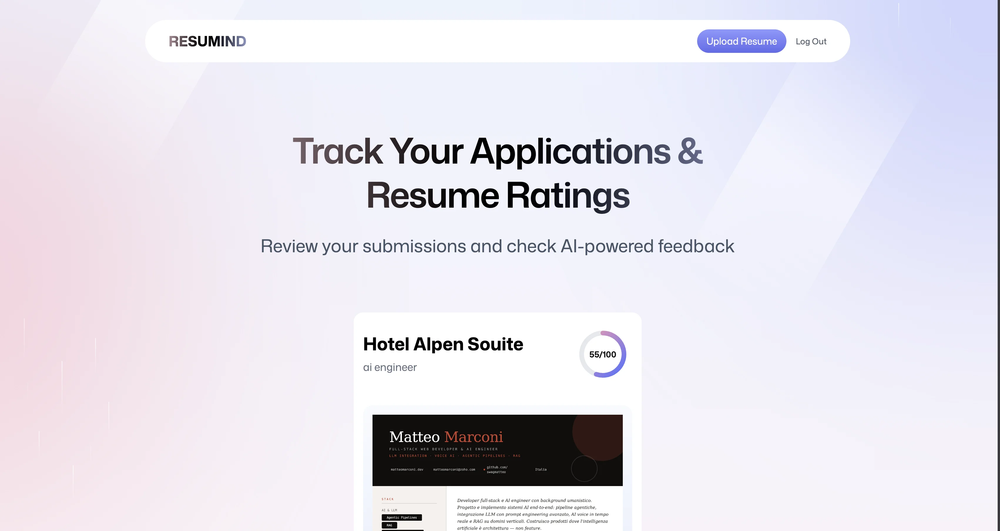

# Resumind

Full-stack AI web app that analyzes a CV, returns an ATS score, and provides detailed feedback calibrated on a target job description.



## Links

- Repository: [github.com/matterconi/ai-resume-pdf](https://github.com/matterconi/ai-resume-pdf)

## Features

- Upload and parse PDF resumes in the browser
- Score resumes against a target job description
- Generate structured AI feedback by category
- Store resume data with a database-backed filesystem abstraction
- Authentication with Better Auth and Google OAuth support
- Modern React Router app with server rendering

## Tech Stack

- React 19
- React Router v7
- TypeScript
- Tailwind CSS v4
- Drizzle ORM
- PostgreSQL
- Better Auth
- Google OAuth
- DeepSeek API
- PDF.js
- Zustand
- react-dropzone
- Docker
- Vite

## Getting Started

Install dependencies:

```bash
npm install
```

Run the development server:

```bash
npm run dev
```

Open [http://localhost:5173](http://localhost:5173).

## Scripts

```bash
npm run dev
npm run build
npm run start
npm run typecheck
```
